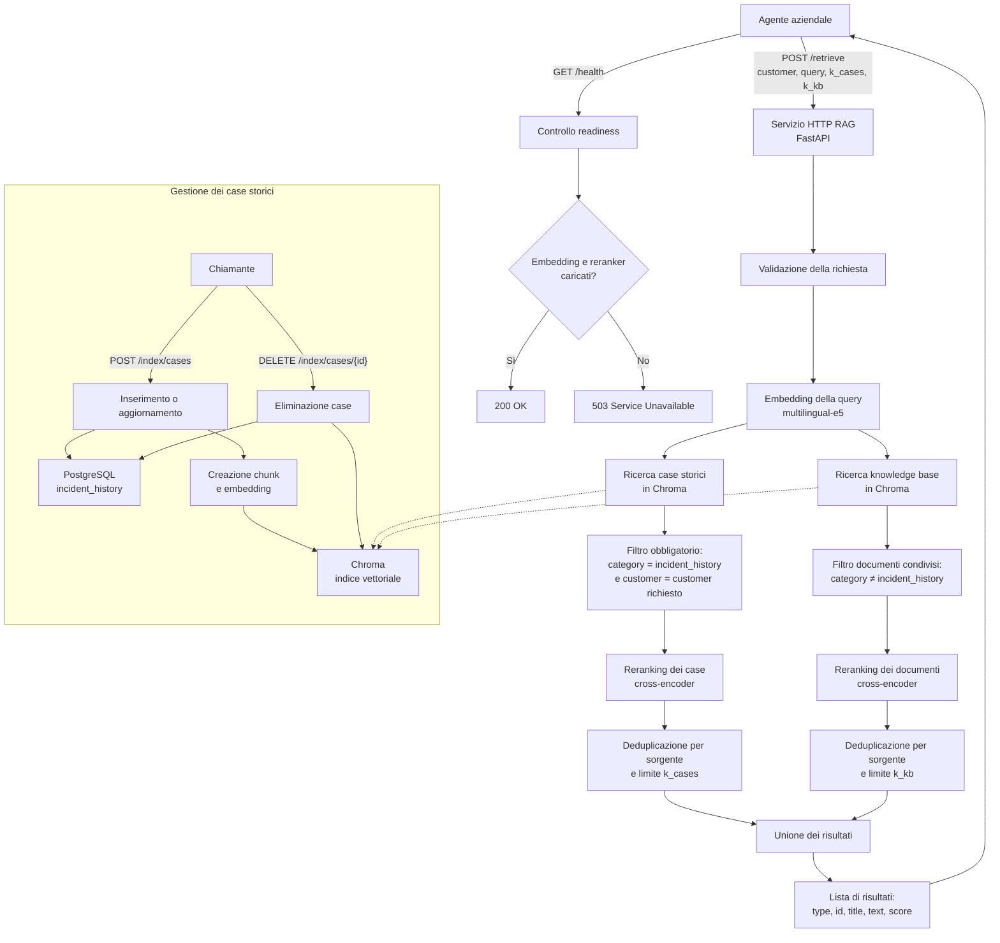

```mermaid
flowchart TD
    Agent["Agente aziendale"] -->|"POST /retrieve<br/>customer, query, k_cases, k_kb"| API["Servizio HTTP RAG<br/>FastAPI"]

    Agent -->|"GET /health"| Health["Controllo readiness"]
    Health --> Ready{"Embedding e reranker<br/>caricati?"}
    Ready -->|"Sì"| HealthOK["200 OK"]
    Ready -->|"No"| HealthWait["503 Service Unavailable"]

    API --> Validate["Validazione della richiesta"]
    Validate --> Embed["Embedding della query<br/>multilingual-e5"]
    Embed --> CaseSearch["Ricerca case storici<br/>in Chroma"]
    Embed --> KBSearch["Ricerca knowledge base<br/>in Chroma"]

    CaseSearch --> CaseFilter["Filtro obbligatorio:<br/>category = incident_history<br/>e customer = customer richiesto"]
    KBSearch --> KBFilter["Filtro documenti condivisi:<br/>category ≠ incident_history"]

    CaseFilter --> CaseRerank["Reranking dei case<br/>cross-encoder"]
    KBFilter --> KBRerank["Reranking dei documenti<br/>cross-encoder"]

    CaseRerank --> CaseLimit["Deduplicazione per sorgente<br/>e limite k_cases"]
    KBRerank --> KBLimit["Deduplicazione per sorgente<br/>e limite k_kb"]

    CaseLimit --> Merge["Unione dei risultati"]
    KBLimit --> Merge
    Merge --> Response["Lista di risultati:<br/>type, id, title, text, score"]
    Response --> Agent

    subgraph Indexing["Gestione dei case storici"]
        Client["Chiamante"] -->|"POST /index/cases"| Upsert["Inserimento o aggiornamento"]
        Upsert --> DB["PostgreSQL<br/>incident_history"]
        Upsert --> Chunks["Creazione chunk<br/>e embedding"]
        Chunks --> Chroma["Chroma<br/>indice vettoriale"]
        Client -->|"DELETE /index/cases/{id}"| Delete["Eliminazione case"]
        Delete --> DB
        Delete --> Chroma
    end

    CaseSearch -.-> Chroma
    KBSearch -.-> Chroma
```