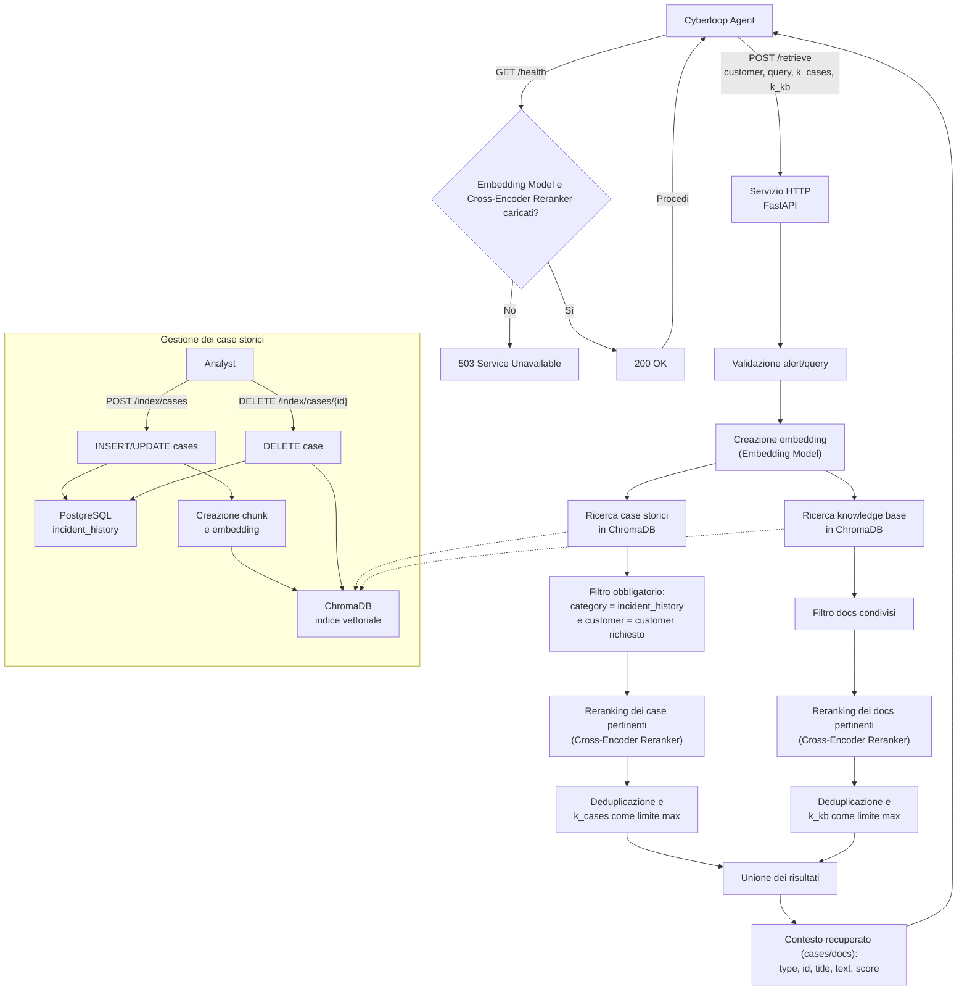

```mermaid
flowchart TD
    Agent["Cyberloop Agent"] -->|"POST /retrieve<br/>customer, query, k_cases, k_kb"| API["Servizio HTTP<br/>FastAPI"]
    Agent -->|"GET /health"| Ready{"Embedding Model e <br/>Cross-Encoder Reranker caricati?"}
    
    Ready -->|"No"| HealthWait["503 Service Unavailable"]
    Ready -->|"Sì"| HealthOK["200 OK"]
    HealthOK --> |"Procedi"|Agent

    

    API --> Validate["Validazione alert/query"]
    Validate --> Embed["Creazione embedding<br/>(Embedding Model)"]
    Embed --> CaseSearch["Ricerca case storici<br/>in ChromaDB"]
    Embed --> KBSearch["Ricerca knowledge base<br/>in ChromaDB"]

    CaseSearch --> CaseFilter["Filtro obbligatorio:<br/>category = incident_history<br/>e customer = customer richiesto"]
    KBSearch --> KBFilter["Filtro docs condivisi"]

    CaseFilter --> CaseRerank["Reranking dei case pertinenti<br/>(Cross-Encoder Reranker)"]
    KBFilter --> KBRerank["Reranking dei docs pertinenti<br/>(Cross-Encoder Reranker)"]

    CaseRerank --> CaseLimit["Deduplicazione e <br/> k_cases come limite max"]
    KBRerank --> KBLimit["Deduplicazione e <br/> k_kb come limite max"]

    CaseLimit --> Merge["Unione dei risultati"]
    KBLimit --> Merge
    Merge --> Response["Contesto recuperato (cases/docs):<br/>type, id, title, text, score"]
    Response --> Agent

    subgraph Indexing["Gestione dei case storici"]
        Client["Analyst"] -->|"POST /index/cases"| Upsert["INSERT/UPDATE cases"]
        Upsert --> DB["PostgreSQL<br/>incident_history"]
        Upsert --> Chunks["Creazione chunk<br/>e embedding"]
        Chunks --> ChromaDB["ChromaDB<br/>indice vettoriale"]
        Client -->|"DELETE /index/cases/{id}"| Delete["DELETE case"]
        Delete --> DB
        Delete --> ChromaDB
    end

    CaseSearch -.-> ChromaDB
    KBSearch -.-> ChromaDB
```